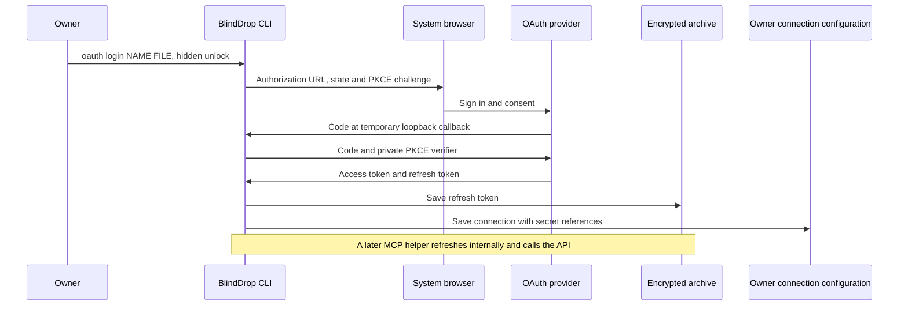

# Owner OAuth setup

BlindDrop can obtain a refresh grant through ordinary browser consent.
The owner runs this once; agents subsequently use the connection through the
existing MCP helper.
Controlled receiver proof and live provider proof are separate layers;
[CHANGELOG.md](CHANGELOG.md) states which providers have been exercised live.



## What the provider must already offer

An OAuth client registration permitting authorization code with S256 PKCE,
an HTTP loopback redirect, and a refresh token. Use the provider's normal
registration and consent controls; it needs no BlindDrop-specific integration.
The callback is `http://127.0.0.1:PORT/oauth/callback`. Omit `redirectPort` for
a free port; set it when the registration requires one specific port. Register
the exact callback required by that provider. Browser and CLI run on the same
machine. This is not the device-code flow or an OpenID identity login.

## Example: Google Drive

This template follows Google's documented endpoints and desktop flow; a
live Google account has **not** been verified. Configure your own desktop
OAuth client and enable Drive for that project. Do not use `openid`, `email`
or `profile` identity scopes for this API-only flow. Google's client secret,
if required by your registration, is stored as a vault entry rather than in
the JSON definition. [Google desktop OAuth guidance](https://developers.google.com/identity/protocols/oauth2/native-app).

For a client using body authentication, first run:

```sh
blinddrop secret set google-client-secret
```

Enter the existing vault passphrase and client secret at the hidden prompts.
Do not initialize an existing vault again. Save this non-secret configuration
as `google-drive.json`, replacing the public client ID:

```json
{
  "issuer": "https://accounts.google.com",
  "authorizationEndpoint": "https://accounts.google.com/o/oauth2/v2/auth",
  "authorizationParameters": { "access_type": "offline", "prompt": "consent" },
  "connection": {
    "origin": "https://www.googleapis.com",
    "allowPrivate": false,
    "enabled": true,
    "auth": {
      "type": "oauth2",
      "tokenEndpoint": "https://oauth2.googleapis.com/token",
      "grant": "refresh_token",
      "clientId": "YOUR_CLIENT_ID.apps.googleusercontent.com",
      "clientAuth": "body",
      "clientSecret": "google-client-secret",
      "refreshSecret": "google-drive-refresh",
      "scope": "https://www.googleapis.com/auth/drive.readonly"
    }
  }
}
```

For a registered public client that does not require a client secret, use
`"clientAuth": "none"` and omit `clientSecret`. Basic authentication is also
available when the provider requires it. Preserve the provider's exact issuer
identifier, including whether it ends with `/`.

```sh
blinddrop oauth login google-drive ./google-drive.json
blinddrop list
```

Unlock once, complete the provider's normal browser flow, then wait for the
CLI's `OAuth grant and connection saved for the next session.` message.
The callback page only confirms receipt; the CLI confirms successful storage.
The refresh grant persists in the archive until replaced/removed; the provider
can independently expire or revoke it. “Next session” means existing helpers
keep their old snapshot, not that the saved secret expires when BlindDrop exits.

Stop an existing helper before replacing its credentials. Start a new helper
with `serve --allow google-drive --ttl 3600` through the normal MCP host setup.
The agent can then call `execute_http` with:

```json
{
  "connection": "google-drive",
  "path": "/drive/v3/files",
  "query": { "pageSize": "10", "fields": "files(id,name)" }
}
```

OAuth consent may require provider-specific offline-access parameters or
renewed consent before a refresh token is returned. An access-token-only
response fails without changing the vault. Google's offline-access guidance
explains its refresh-token issuance rules. [Google offline access](https://developers.google.com/identity/protocols/oauth2/web-server#offline).

## Other providers and fixed token targets

Use the provider's documented issuer, authorization endpoint, token endpoint,
resource origin, scopes and client authentication. `authorizationParameters`
is a bounded map for fixed extras such as `prompt` or `access_type`, never
credential values. Protocol fields, request objects, response mode, state,
PKCE, redirect, scope and targets cannot be overridden there.

OAuth `auth` accepts optional `audience` and `resource`, each a single owner-fixed
string of at most 2048 UTF-8 bytes. `resource` must be an absolute URI without
a fragment. Supply them only when the provider expects them. They are sent
with authorization/code exchange and with the configured client-credentials
or refresh grant. An agent's API query cannot change token targets. These
fields do not change or authorize network destinations.

## Lifetime, errors and proof limits

The command waits up to five minutes, then closes its loopback listener. Ctrl-C
or SIGTERM cancels it. Exchanges have the existing 30-second HTTPS bound.
There is no background login process after completion. Failed consent, state,
issuer, code verification, exchange or persistence returns a static error;
the command does not print the code, verifier or tokens. The access token from
onboarding is discarded; a future helper acquires its own through refresh.

`--no-browser` prints the authorization URL in the owner terminal for manual
opening and otherwise follows the same flow. The default launcher uses the established cross-platform `open` package. Actual desktop browser launch has not been exercised end to end on any platform; using a portable library is not desktop proof. Custom URI schemes, discovery, device flow, OpenID login and DPoP-bound grants are not implemented. Existing refresh expiry, rotation and persistence
rules remain those in the spec; resource requests are never automatically
replayed after an ambiguous failure or a 401.
