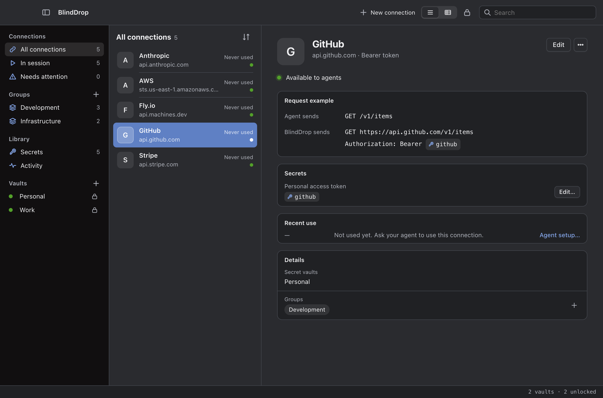
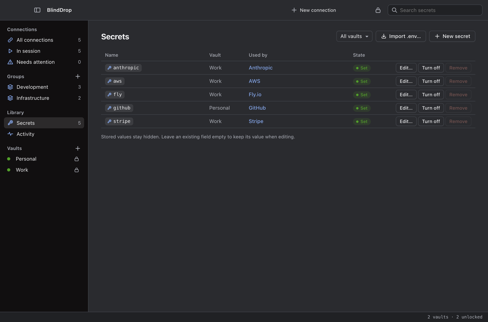
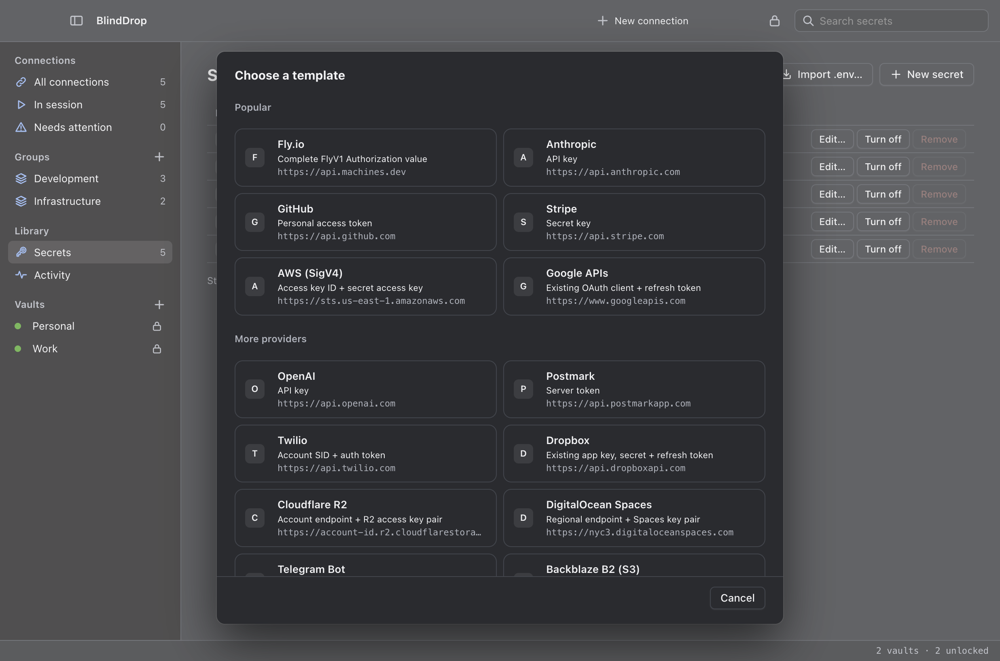

<p align="center">
  
</p>

<h1 align="center">BlindDrop</h1>

> *“If you want to keep a secret, you must also hide it from yourself.”*
>
> — George Orwell, *Nineteen Eighty-Four*

BlindDrop lets your agents use API keys without putting those keys in their
prompts, scripts, or client configuration.

Think of a password manager's autofill, but for API requests. You store a key in
an encrypted vault on your computer and choose which connections an agent can
use. BlindDrop adds the key when it sends a request, checks the response, and
returns the result.

Providers receive their usual authentication. They do not need to change
anything to work with BlindDrop.

<p align="center">
  <a href="https://github.com/IluvatarLabs/blinddrop/releases/latest">Download</a> ·
  <a href="#install">Get started</a> ·
  <a href="https://github.com/IluvatarLabs/blinddrop/issues">Bugs & ideas</a>
</p>

<p align="center">
  <a href="assets/screenshots/connections.png"></a>
</p>

<p align="center"><strong>Encrypted secret library</strong></p>
<p align="center">
  <a href="assets/screenshots/secrets.png"></a>
</p>

<p align="center"><strong>Service templates</strong></p>
<p align="center">
  <a href="assets/screenshots/templates.png"></a>
</p>

<p align="center"><sub>BlindDrop 0.6.0 with demo data. No real credentials or connected accounts.</sub></p>

## Why

Giving an agent a key gives it a copy. That copy can end up in a conversation,
a generated script, or a log.

BlindDrop keeps the key in a local vault and makes requests on the agent's
behalf. You unlock the helper once for a session. The agent can use the
connections you allowed, but has no tool for reading their keys.

Each vault is a file you own, with its own passphrase and lock state. You can
copy it, back it up, and move it to another computer. Locking a vault removes
the connections that need it; locking every vault or quitting the helper ends
the session. Saved keys remain encrypted in their vaults. There is no
subscription or hosted account to maintain.

## Install

Download the Mac app from the [BlindDrop 0.6.0 release](https://github.com/IluvatarLabs/blinddrop/releases/tag/v0.6.0), move **BlindDrop.app** into Applications, and open it. The download is for Apple silicon Macs and is unsigned and not notarized. The app includes its runtime: no Node installation, global CLI, PATH changes or terminal are needed.

If macOS blocks the first launch, follow [Apple's instructions for opening an app from an unidentified developer](https://support.apple.com/en-us/102445).

1. Create a vault with a passphrase, or open an existing encrypted vault.
2. Choose a connection template, enter its credential in the owner window, and save.
3. Open **Settings → Sessions** and install the integration for Claude Code or local Codex. Follow the host trust/reload instruction shown there.
4. Unlock the vaults the connection needs, then ask the agent to use that connection.

Connections hold service origins and authentication settings; Secrets hold the encrypted credentials they reference. A template identifies the credentials it needs. When editing a connection, you can choose an existing stored secret without re-entering its value. **Import .env** uses Node's standard dotenv parsing and lets you review names and selected rows before anything is saved.

Closing the window keeps the current session running. A normal Dock or menu-bar click reopens it; right-clicking the menu-bar icon offers Open and Quit. **Settings → General → Show Dock icon** can hide the Dock icon while leaving menu-bar access available. **Settings → Security** can optionally lock all vaults after system inactivity. **Lock All** revokes access, including with no window open; **Quit** stops the app. Every launch starts locked.

To upgrade, quit BlindDrop, replace the app in Applications, then reopen it. Vaults and configuration stay outside the app bundle. There is no automatic updater; use the [release page](https://github.com/IluvatarLabs/blinddrop/releases). If you move the app, use **Update** beside each installed integration to refresh its bundled-helper path.

### Optional command-line package

The CLI requires Node.js 22.13+ on the 22.x line or 23.5+, and npm. Download `blinddrop-0.6.0.tgz` from the release and install that file by its local path:

```sh
npm install --global --prefix "$HOME/.local" ./blinddrop-0.6.0.tgz
export PATH="$HOME/.local/bin:$PATH"
blinddrop --help
```

BlindDrop is not published to the npm registry. Install the release tarball by its path. These shell steps are only for CLI use. The CLI runs without Electron; the downloadable native app is macOS arm64 only, with no Windows or Linux desktop build.

## Optional CLI quick start

This example uses a GitHub personal access token to read your account. Create
a token using GitHub's normal controls, then run these commands in your own
terminal:

```sh
blinddrop init
blinddrop secret set github-pat
blinddrop connection set github \
  --origin https://api.github.com \
  --auth bearer --secret github-pat
```

Run `init` once to create the vault. Passphrases and keys are entered at hidden
prompts. `github-pat` is the name of the saved key; `github` is the connection
that uses it.

Terminal administration operates one archive at a time, and `secret set`
creates or replaces a single-value secret. Use the browser owner page or Mac app
for registered multi-vault workflows, typed multi-field secrets and connections
that draw fields from more than one vault.

The installed package includes an HTTP client. With the user-local prefix
above, make a request with:

```sh
blinddrop run github -- node "$HOME/.local/lib/node_modules/blinddrop/examples/request.mjs" /user
```

Unlock the vault when prompted. The command prints the HTTP status and your
GitHub account details. The client receives a temporary local URL and session
token; BlindDrop supplies the real GitHub token when it contacts the API.
When the command exits, its helper stops.

For another API, use its HTTPS origin and authentication format. See the
[configuration reference](CONFIGURATION.md) and the [Fly.io walkthrough](FLY.md).

## Running it

- `blinddrop ui` opens an owner page in your browser to create, open, unlock or
  lock any of several vaults, and to manage typed multi-field secrets,
  connection groups and static connection templates through the Connections,
  Secrets and Activity views. Unlocking a vault starts or recomputes the
  implicit agent session; locking every vault or quitting ends it. The macOS
  app in `desktop/` shows the same page. Closing its main window leaves the app
  and any unlocked session running from the menu bar; Quit ends the session.
  See the
  [configuration reference](CONFIGURATION.md#owner-gui).
- App-managed [agent integrations](plugin/README.md) install, update and remove BlindDrop's Claude Code/local Codex plugin through each host's native plugin mechanism. Skills teach the workflow, supported hooks provide guidance, and authenticated MCP tools execute it. Configuration status is separate from a successful request. Unrelated host configuration is preserved.
- `blinddrop run CONNECTION -- COMMAND ARGS…` runs a command with a local API
  endpoint and a temporary session token. Existing SDKs can use it if they let
  you configure their base URL and authentication header. Streaming is supported.
- `blinddrop serve --http --allow CONNECTION` starts a helper in your terminal
  for an independently launched MCP client. It prints the MCP URL and session
  token to put in your client's configuration. Leave the helper running.
- `blinddrop serve --allow CONNECTION` uses stdio for MCP clients that launch
  their own helper. See the [client setup](CONFIGURATION.md#agent-session).

Terminal sessions created by `serve` or `run` last one hour by default;
`--ttl SECONDS` changes that. Stopping or expiring the helper ends its session.
A new session gets a new token. The owner page and app instead recompute their
implicit session as vaults and records change. The MCP tools are
`list_connections` and `execute_http`.

App and CLI HTTP sessions share a randomly chosen port saved in Settings. If it
is busy, BlindDrop advances to the next available port and saves the actual
listener. Change the preference in **Settings → Sessions** or with CLI
`--port PORT`; explicit `--port 0` stays temporary. App-managed integrations
follow the actual endpoint. For a manually configured plugin, set
`BLINDDROP_MCP_URL` to the reported `mcpUrl` before starting the host, and
restart or reload the host if that URL changes. The headers helper refreshes the
session credential, but cannot change the host's configured URL.

The [client guide](CLIENTS.md) covers MCP configuration, the Claude SDK,
ordinary HTTP clients, and OAuth APIs. BlindDrop supports common API-key
placements, Basic authentication, OAuth grants, JWT bearer exchange, AWS
SigV4, and client TLS certificates. Native database connections, SSH,
WebSocket, gRPC, and browser login automation are outside this release.

## Your vault

BlindDrop's default configuration directory can contain the default encrypted
vault and these owner-side files:

```text
~/.config/blinddrop/
├── vault.enc               default encrypted vault of secret values
├── vaults.json             vault names and paths, never passphrases
├── connections.json        origins, authentication settings and secret references
├── groups.json             connection groups
├── settings.json           owner page and app settings
└── vault.enc.events.jsonl  request outcomes, without keys or request bodies
```

Other encrypted vault files may live anywhere you choose. Each has its own
passphrase and lock state. A typed secret can hold several named fields, and a
connection refers to the fields it needs as `vault#secret#field`.
`connections.json` contains no stored secret values.

While a session started from the owner page or the app is running with the
session-file option on, `session.json` holds that session's local URL and token
at mode 0600 and is removed when the session ends.

Use **Back Up Setup** to copy all registered encrypted vaults plus connection definitions, registry, groups and settings. Each vault retains its own passphrase. The other files are owner-only plaintext metadata and references; session tokens and Activity are excluded. A missing archive fails the backup instead of silently producing an incomplete copy.

Use **Restore Setup** before adding vault or connection data to a new installation. A first launch containing only saved preferences is accepted and those preferences are replaced by the backup. Registered vaults, connections, groups or unknown files prevent restore. Restore rebases archive paths, starts with every vault locked, and never merges or overwrites existing data. **Export Encrypted Vault** copies one archive only. There is no passphrase recovery bypass. `blinddrop passwd` re-encrypts the selected vault; older backups still need their old passphrase.

BlindDrop protects credentials through its own interfaces. Your agent harness
and operating system must restrict access to the vault's unlock input and the
helper's files and memory. An unrestricted agent on your machine can bypass
that boundary.

The API receives the real credential and must be trusted with it. BlindDrop
blocks direct credential echoes, including across streamed chunks, but cannot
prevent a malicious API from disguising a key in its response. It also cannot
prevent an agent from misusing an action its key permits. See the
[security policy](SECURITY.md) for the full boundary.

## Documentation

- [Client guide](CLIENTS.md) — connect MCP hosts, SDKs, and HTTP clients
- [Plugin](plugin/README.md) — app-managed Claude Code/local Codex integrations and manual skills
- [macOS app](desktop/README.md) — build the app that hosts the owner page
- [Configuration](CONFIGURATION.md) — authentication, connections, backup, and limits
- [Fly.io](FLY.md) — set up and use a Fly connection
- [OAuth](OAUTH.md) — browser consent and saved refresh grants
- [Contributing](CONTRIBUTING.md) — development and checks
- [Security](SECURITY.md) — reporting and trust boundaries
- [Changelog](CHANGELOG.md) — release history

PolyForm Noncommercial 1.0.0 (non-commercial use only). See [LICENSE](LICENSE).
Adapted components retain their [third-party notices](THIRD-PARTY-NOTICES.md).
